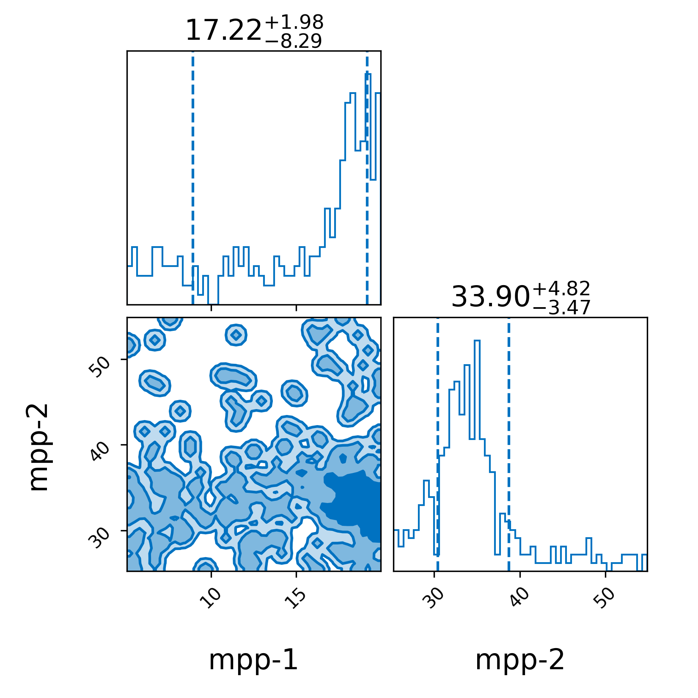

## Demo

The data-collection stage has already been completed. The resulting files are provided in `outdir/data/`.

This demo uses a small dataset and does not include selection effects. It typically finishes in approximately 1–2 minutes on a standard CPU. 

From the repository code folder, add the custom model directories to `PYTHONPATH`:

```bash
export PYTHONPATH="$PWD/demo/models:$PWD/models${PYTHONPATH:+:$PYTHONPATH}"
```

Then run the analysis:

```bash
gwpopulation_pipe_analysis demo/config/demo_config.ini \
    --models mass:ThreePeaks_mass_models.TwoPeakBrokenPowerLawSmoothedMassDistribution \
    --models redshift:gwpopulation.models.redshift.PowerLawRedshift \
    --models spin:effective_spin_chi_model.EffectiveSpinChiEffChiP \
    --vt-function ""
```

The results will be written to the output directory `demo/outdir` specified by `run-dir` in `demo_config.ini`.


### Post-processing

Generate a corner plot from the resulting posterior samples:


```bash

python demo/postprocessing/make_corner_plot.py

```


The resulting posterior distributions for the two Gaussian-peak locations are shown below:
<p align="center">
  
</p>


